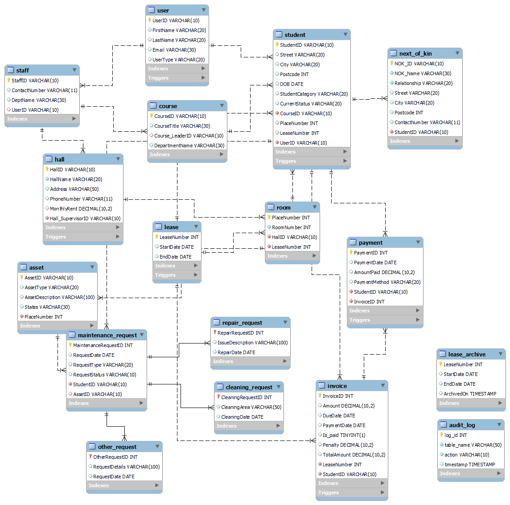
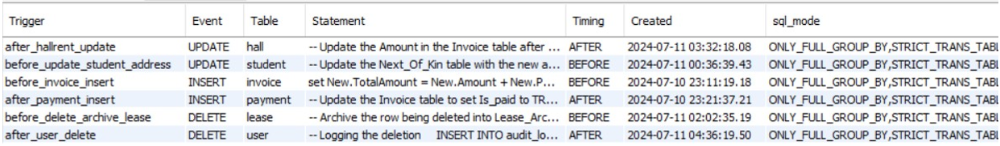
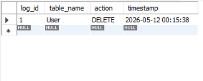
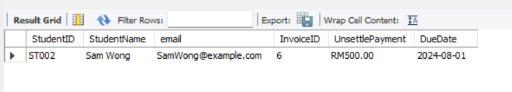
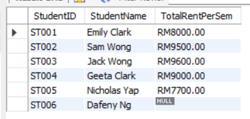
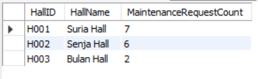

# 🏢 Student Housing Management System (Database)

A MySQL relational database designed to manage high-density student accommodation. This system tracks everything from student registration and room allocation to automated maintenance logging and financial reporting.

## 🌟 Key Features
* **Comprehensive Schema:** 15 core relational entities supported by dedicated `audit_log` and `lease_archive` tables.
* **Automated Auditing:** Custom triggers to log administrative changes and track "auto-cancel" logic.
* **Financial Analytics:** Complex queries for revenue forecasting and occupancy rate tracking.
* **Maintenance Logic:** Integrated modules for tracking work orders and facility health.

---

## 🗺️ Database Architecture (EER Diagram)
Below is the Enhanced Entity-Relationship (EER) diagram representing the system's architecture.



---

## 🚀 Getting Started

### Prerequisites
* MySQL Workbench 8.0+
* MySQL Server 8.0

### Installation
1.  **Clone the repository:**
    ```bash
    git clone [https://github.com/enyin-yap/student-housing-management-system-db.git](https://github.com/enyin-yap/student-housing-management-system-db.git)
    ```
2.  **Initialize the Schema:**
    Run `schema.sql` in MySQL Workbench to build the 16-table structure and triggers.
3.  **Populate Data:**
    Run `seed_data.sql` to import realistic student, room, and financial records.
4.  **Explore Insights:**
    Run `operational_queries.sql` to view pre-built analytics reports.

---

## 📊 Operational Insights & Evidence

### 1. Automated System Triggers
We implemented triggers to ensure data integrity and historical tracking. Below is the trigger list within the system.



* **Audit Log:** Captures any `UPDATE` or `DELETE` on sensitive student records.
This screenshot shows the `audit_log` table capturing a record change, demonstrating our trigger logic.


## 2. Analytics Queries
These screenshots demonstrate the database's ability to generate complex business insights:
* **Unpaid Invoice Tracking**
  * *Purpose:* Identifies students with outstanding balances for debt collection.
  

* **Semester Rent Calculation**
  * *Purpose:* Tracks semester-based revenue per student across various halls.
  

* **Maintenance Demand Analysis**
  * *Purpose:* Measures facility ability to optimize maintenance worker allocation.
  
---

## 🛠️ Tech Stack
* **Database:** MySQL
* **Design Tool:** MySQL Workbench
* **Documentation:** Markdown, EER Modeling

## 👥 Project Team
* **Team Leader:** Yap En Yin
* **Team Member:** Ong Shi Ning
* **Team Member:** Nicholas Ng Yan Zhe
* **Team Member:** Nik Zhi An
* **Team Member:** Yap Jiunn Yu

---

## 📄 License
This project is licensed under the **MIT License**.